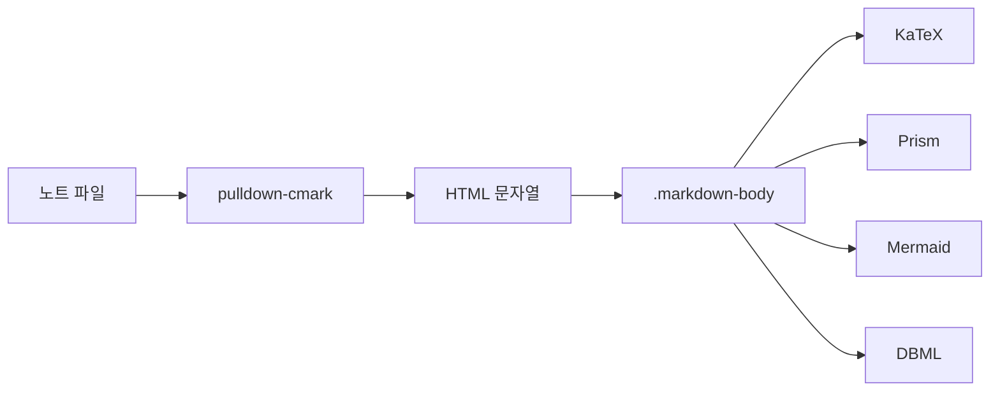
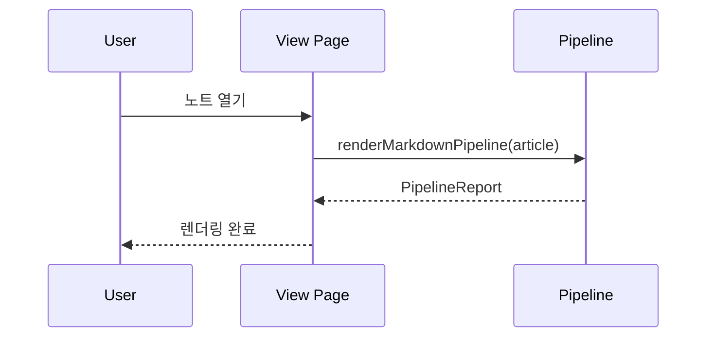
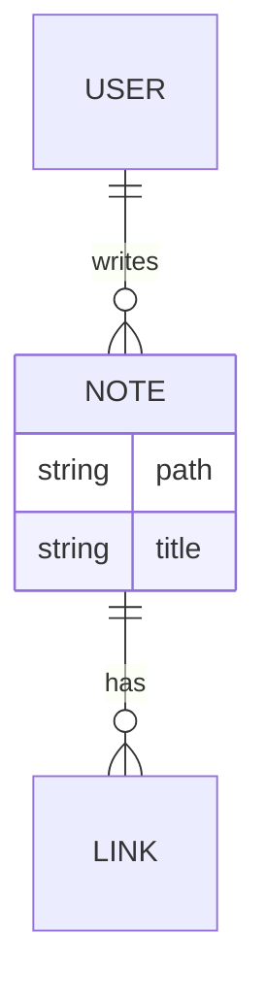

# 마크다운 렌더링 데모 (Slice 1.3)

Slice 1.3의 GFM 확장 · 하이라이팅 · 수식 · 다이어그램을 한 번에 확인하기 위한 샘플 노트.

## 1. GFM 확장

### 테이블
| 언어   | 런타임  | 타입 시스템 |
|--------|---------|-------------|
| Rust   | native  | 정적        |
| Kotlin | JVM     | 정적        |
| Python | CPython | 동적        |

### 체크박스
- [x] Spec 작성
- [x] Rust GFM 옵션 확장
- [x] 프론트 렌더 파이프라인
- [ ] 수동 검증 완료

### 취소선과 스마트 구두점
~~옛 방식~~ → "새 방식" -- 더 간단 ...

### 각주
본문 흐름 중 참조[^src]가 등장하면 하단에 정리된다.

[^src]: 각주 예시 — 참고 링크나 부연 설명용.

## 2. 위키링크

관련: [[index]], [[another-note|다른 노트]]

## 3. 코드 하이라이팅

```rust
fn fibonacci(n: u32) -> u64 {
    match n {
        0 => 0,
        1 => 1,
        _ => fibonacci(n - 1) + fibonacci(n - 2),
    }
}
```

```kotlin
data class User(val id: Long, val name: String) {
    fun greeting() = "안녕, $name!"
}
```

```typescript
interface Note {
  path: string
  title: string
  tags: string[]
}

async function loadNote(path: string): Promise<Note> {
  return invoke("get_note", { path })
}
```

```python
def sieve(limit: int) -> list[int]:
    is_prime = [True] * (limit + 1)
    for i in range(2, int(limit**0.5) + 1):
        if is_prime[i]:
            for j in range(i*i, limit + 1, i):
                is_prime[j] = False
    return [i for i in range(2, limit + 1) if is_prime[i]]
```

```bash
#!/usr/bin/env bash
set -euo pipefail
for f in *.md; do
  echo "Processing: $f"
done
```

```sql
SELECT u.id, u.name, COUNT(n.id) AS note_count
FROM users u
LEFT JOIN notes n ON n.author_id = u.id
GROUP BY u.id, u.name
ORDER BY note_count DESC;
```

```diff
- const oldApi = "/v1/notes";
+ const newApi = "/v2/notes";
```

## 4. 수식 (KaTeX)

인라인: 오일러 공식 $e^{i\pi} + 1 = 0$ 와 이차방정식 해 $x = \frac{-b \pm \sqrt{b^2 - 4ac}}{2a}$.

블록:

$$
\int_{-\infty}^{\infty} e^{-x^2}\, dx = \sqrt{\pi}
$$

$$
\mathbf{A} = \begin{pmatrix}
  a_{11} & a_{12} \\
  a_{21} & a_{22}
\end{pmatrix}
$$

## 5. Mermaid 다이어그램







## 6. 의도적 파싱 실패 (오류 처리 검증)

아래 블록은 고의로 문법이 깨져 있다. 원본 보존 + 오류 오버레이만 떠야 하고,
페이지 하단에 폭탄 SVG가 남지 않아야 한다.

```mermaid
flowchart LR
  이건 올바르지 않은 노드 문법 @@@ >>>
```

인라인 수식 오류: $\unknowncmd$.
(닫히지 않은 중괄호가 포함되면 KaTeX auto-render가 아예 구분자로 인식하지 않아 에러 스팬이 생기지 않는다. 에러 오버레이 렌더를 검증하려면 괄호 밸런스가 맞는 잘못된 LaTeX여야 한다.)

## 7. 기타

> 인용구: 이 노트는 Slice 1.3 수동 검증용 고정 샘플이다.

- 일반 리스트 항목
- **굵게**, *기울임*, `인라인 코드`
